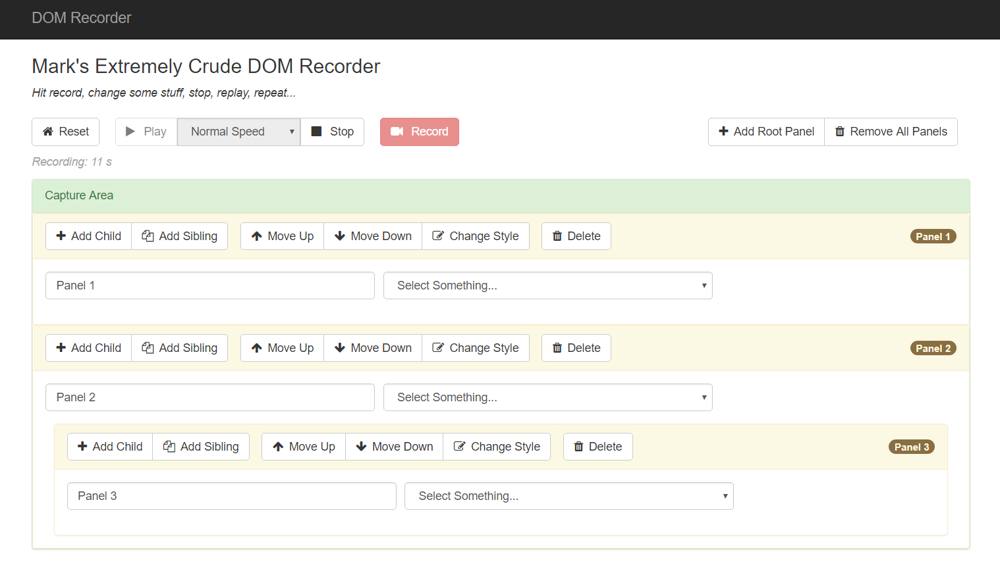

# PageRecorder DOM Recorder Prototype

This prototype uses the [Mutation Observer](https://developer.mozilla.org/en-US/docs/Web/API/MutationObserver) interface and various event listeners to capture changes to the DOM in real time, queuing up time tagged deltas in lightweight objects to support real time replayability of the changes. This is a crude attempt to gain a better insight into the core recording concepts used by the [FullStory](https://www.fullstory.com/) platform.

## Usage

- Visit the [live demo](http://35.196.4.233/) and Click Record
- Change the DOM inside the capture area via the supplied tools. You can indefinitely nest new children, reorder siblings, delete elements, change styles, and enter new values in the provided inputs.
- Hit Stop and Play to replay your session. You can adjust the playback speed via the dropdown.
- Hit Record to start a new session

Or [watch the video](http://recordit.co/zuQAJ7DqwT)!

### Future Directions

*Also known as "if I had infinite time"...*

- Live stream the change events via websocket to the server for collection.
- Live stream the changes back via websocket to render locally.
- Store snapshot sessions in persistent storage. (No-SQL store like Dynamo)
- Support more event types, for example mouse move, clicks, etc.
- Capture full page changes on load. (async load of lightweight JS include in Head tag)
- Code is definitely prototype level. I tried to keep it semi-clean, but the focus was primarily on efficient learning and not enterprise grade software.
- Rewrite in Go on server side

## Known Limitations

This is very much a "happy path" prototype to learn the core concepts, demonstrate some DOM skills, and have some fun. A small set of many limitations:

- Primarily tested on Chrome
- Doesn't capture mouse moves, clicks, render events, etc.
- Doesn't capture the whole page, just what's inside the capture area. (although knock on wood should work fine with whole page)
- Local performance and memory footprint could be a lot better.
- Not secured server side 
- Sessions are ephemeral and locally stored
- CSS and Javascript intentionally not combined, minified and cache-busting versioned so you can easily view source from the demo. It's a 1-liner to turn that on for the project.

## About the Design

Server side code is primarily ASP.Net boilerplate MVC. I did stub in some minimal ajax handlers to prototype the roundtrip storage of sessions with the ultimate goal of streaming via websockets, but ran out of time. See [code](https://github.com/marktisham/PageRecorder/blob/7f4bc72fc9099df94d23516070ef395f07926fd2/PageRecorder/Controllers/HomeController.cs#L33). 

The bulk of the interesting logic is in TypeScript in 4 [primary objects](https://github.com/marktisham/PageRecorder/tree/master/PageRecorder/Scripts/PageRecorder):

- **Controller** - orchestrates the actions on the page
- **DOMRecorder** - captures the MutationRecord events and change event listeners and stores them in a queue of lightweight DOMChange ojects
- **DOMChange** - lightweight object with minimal change data. Designed to be serializable to JSON for server storage. 
- **DOMPlayer** - replays the sequence of DOMChange objects in order (waiting for the logged time durations to pass). Assumes base DOM state from time of recording is set by controller.

## Lessons Learned

- Lots and lots about MutationObserver, see usage in [code](https://github.com/marktisham/PageRecorder/blob/7f4bc72fc9099df94d23516070ef395f07926fd2/PageRecorder/Scripts/PageRecorder/DOMRecorder.ts#L16).
- MutationObserver doesn't get everything, for example keyboard events and selection changes. addEventListener to the rescue, see in [code](https://github.com/marktisham/PageRecorder/blob/7f4bc72fc9099df94d23516070ef395f07926fd2/PageRecorder/Scripts/PageRecorder/DOMRecorder.ts#L78).
- MutationObserver returned HTML NodeLists in many places, but to capture many of the changes of interest you need an HTML Element, which is derived from Node. Suffice it to say, this does not play well with TypeScript so I had to work around with less safe code in a few places, see in [code](https://github.com/marktisham/PageRecorder/blob/7f4bc72fc9099df94d23516070ef395f07926fd2/PageRecorder/Scripts/PageRecorder/DOMChange.ts#L22).
- I was not able to serialize NodeElement objects from the DOM due to their extensive declaration of function properties. That's okay, though, since the object was a beast. DOMChange is much lighter weight and should serialize okay.
- Several quirky DOM edge cases came up, and i'm sure several more or lurking. For example, when rendering a changed 'select' component extra inner text nodes would get rendered as children, likely stemming from node vs element differences (or whitespace in the html). Didn't have time to dig into that, so worked around. See [code](https://github.com/marktisham/PageRecorder/blob/7f4bc72fc9099df94d23516070ef395f07926fd2/PageRecorder/Scripts/PageRecorder/DOMChange.ts#L87) 

## In Conclusion

The primary purpose of this exercise was to learn more about how DOM record and playbook could / does work. FullStory has clearly gone wayyyyy beyond this very simple case, but it was helpful to dig into the tech a little to see the foundation. Learned a lot and had a blast along the way. Hopefully this also gives you a better window into my coding style too.

